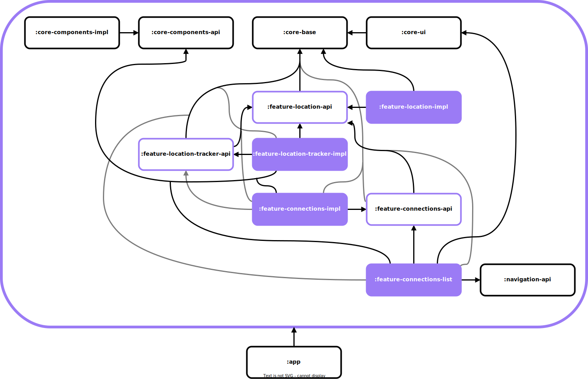
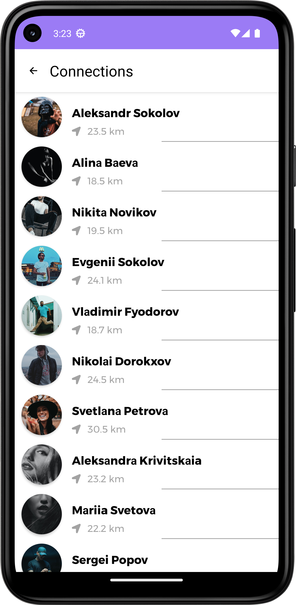
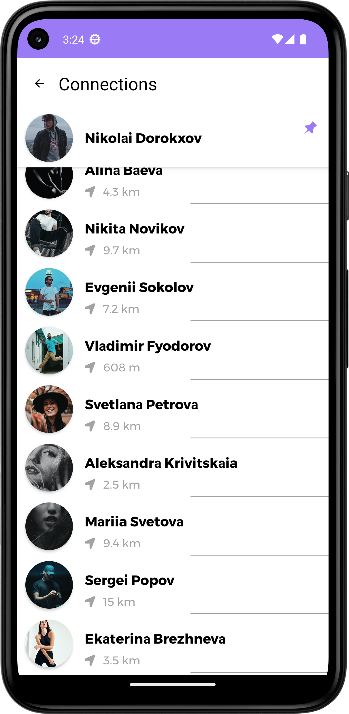
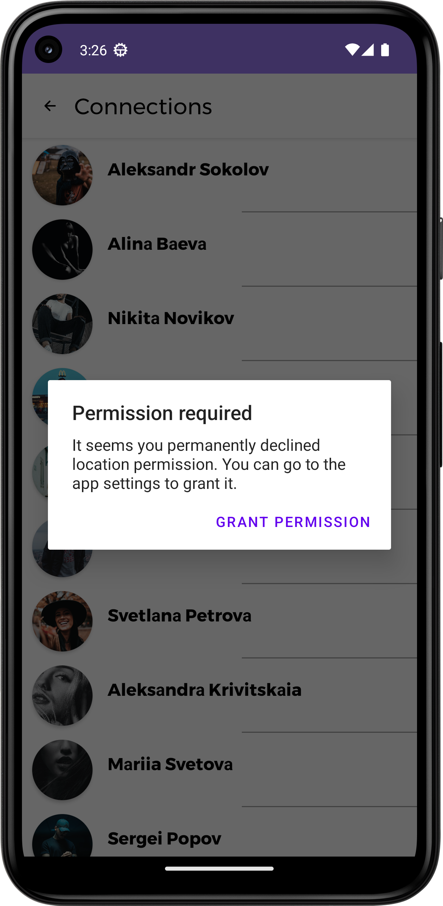
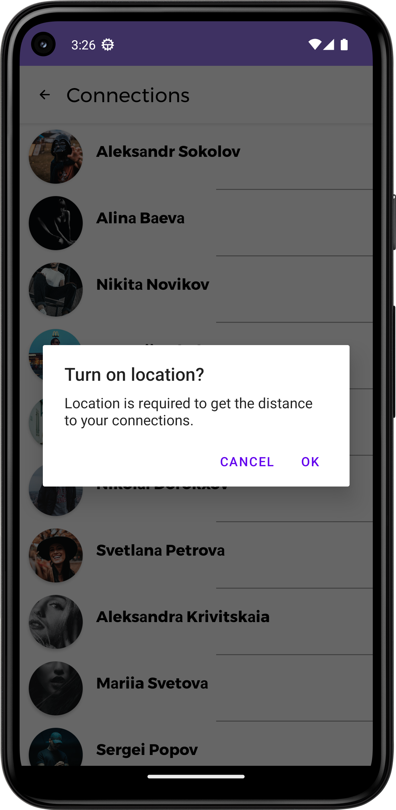

# Connections list feature example
Connections list feature example. May be partly modified and used in your application if you need to get list of some user's connections with displaying distance from user to its connections.

## Content
* [Description](#description)
* [Tech Stack](#tech_stack)
* [Architecture](#architecture)
* [Screenshots](#screenshots)

## Description
An example app for getting list of files and directories on device was made as a job test task.

Application is built according to the principles of SOLID and [Сlean architecture](https://blog.cleancoder.com/uncle-bob/2012/08/13/the-clean-architecture.html). MVVM is used as a design pattern. MVI based on MVVM and Kotlin Coroutines [StateFlow](https://kotlinlang.org/api/kotlinx.coroutines/kotlinx-coroutines-core/kotlinx.coroutines.flow/-state-flow/) and implemented via [Orbit Multiplatform](https://orbit-mvi.org/) library

## Tech Stack
DI, Async:
* [Dagger](https://github.com/google/dagger)
* [Kotlin Coroutines](https://github.com/Kotlin/kotlinx.coroutines)

Jetpack:
* [Navigation Component](https://developer.android.com/guide/navigation/get-started)
* [ViewModel](https://developer.android.com/topic/libraries/architecture/viewmodel)

Extras:
* [OrbitMVI](https://github.com/orbit-mvi/orbit-mvi)

## Architecture
All application modules are presented in the diagram:

Application separated into different modules according to "core"-"feature" separation. Most of "feature" modules are divided into "api" and "implementation" to create an opportunity for different "feature" modules to be dependent from other "feature" modules via some "API" without certain implementation.

## Screenshots
 

 
